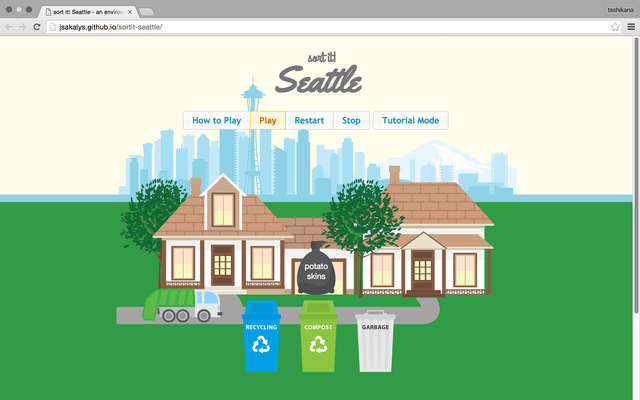
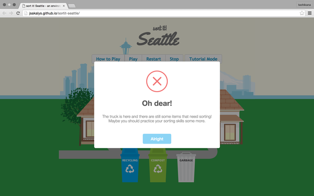

# Sort it! Seattle

This game is a fun single-player game where the player must "race the clock" to sort all of the rubbish into the proper bin before the garbage collector arrives. It features a tutorial mode that color-codes rubbish items to help the player learn the difference between compostables, recycling, and garbage. The game was written in JavaScript and takes advantage of jQuery UI's draggable and droppable functions.

### Screenshots

### Credits
* [jQuery](http://jquery.com)
* [jQuery UI](http://jqueryui.com)
* [Sweet Alert](http://t4t5.github.io/sweetalert/)
* [Google Web Fonts - Yellowtail & Grand Hotel](http://google.com/fonts)
* [Vecteezy (graphics)](http://vecteezy.com)
